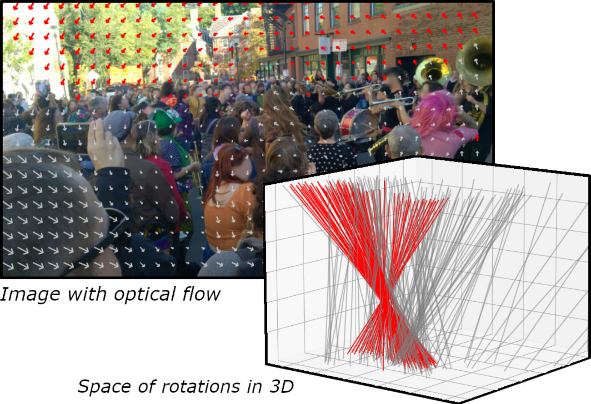

<!--
Copyright (C) 2023-2024 Mitsubishi Electric Research Laboratories (MERL)

SPDX-License-Identifier: AGPL-3.0-or-later
-->

# Robust frame-to-frame camera rotation estimation in crowded scenes

<b>IEEE/CVF International Conference on Computer Vision (ICCV), 2023</b>

<b>Authors:</b><br>
Fabien Delattre (University of Massachusetts Amherst)<br>
David Dirnfeld (University of Massachusetts Amherst)<br>
Phat Nguyen (University of Massachusetts Amherst)<br>
Stephen Scarano (University of Massachusetts Amherst)<br>
Michael J. Jones (Mitsubishi Electric Research Laboratories)<br>
Pedro Miraldo (Mitsubishi Electric Research Laboratories)<br>
Erik Learned-Miller (University of Massachusetts Amherst)<br>

September 12, 2023

<br>

## Features

We present an approach to estimating camera rotation in crowded, real-world scenes from handheld monocular video. While camera rotation estimation is a well-studied problem, no previous methods exhibit both high accuracy and acceptable speed in this setting. Because the setting is not addressed well by other datasets, we provide a new dataset and benchmark, with high-accuracy, rigorously verified ground truth, on 17 video sequences. Methods developed for wide baseline stereo (e.g., 5-point methods) perform poorly on monocular video. On the other hand, methods used in autonomous driving (e.g., SLAM) leverage specific sensor setups, specific motion models, or local optimization strategies (lagging batch processing) and do not generalize well to handheld video. Finally, for dynamic scenes, commonly used robustification techniques like RANSAC require large numbers of iterations, and become prohibitively slow. We introduce a novel generalization of the Hough transform on SO(3) to efficiently and robustly find the camera rotation most compatible with optical flow. Among comparably fast methods, ours reduces error by almost 50% over the next best, and is more accurate than any method, irrespective of speed. This represents a strong new performance point for crowded scenes, an important setting for computer vision.

[Project page](https://www.merl.com/publications/TR2023-123) | [Video](https://youtu.be/D5CzGBG7UA4) | [PDF](https://www.merl.com/publications/docs/TR2023-123.pdf)

## Installation

The code has been tested using python 3.11.
Using [Anaconda](https://docs.anaconda.com/anaconda/install/index.html), create a new conda environment by running
```bash
conda env create -n rotation_estimation --file environment.yaml
```
and activate it using
```bash
conda activate rotation_estimation
```


## Usage

To evaluate the code on BUSS dataset (download [here](https://fabiendelattre.com/robust-rotation-estimation/buss.html)), run
```bash
python evaluate.py --buss_path=/path/to/buss
```


## Testing

Run the demo on ```flow.npy``` using:
```bash
python robust_estimation.py --flow=flow.npy
```


## Citation

If you use the software, please cite the following ([TR_2023-123](https://www.merl.com/publications/TR2023-123)):

```BibTeX
@inproceedings{
    author = {Fabien Delattre and David Dirnfeld and Phat Nguyen and Stephen Scarano and Michael J. Jones and Pedro Miraldo and Erik Learned-Miller},
    title = {Robust Frame-to-Frame Camera Rotation Estimation in Crowded Scenes},
    booktitle = {IEEE/CVF International Conference on Computer Vision (ICCV)},
    year = 2023,
    pages = {9752-9762},
    month = 10
}
```

## MERL Contacts

Pedro Miraldo<br>
Principal Research Scientist<br>
Mitsubishi Electric Research Laboratories<br>
E-Mail: miraldo@merl.com

Michael J. Jones<br>
Senior Principal Research Scientist<br>
Mitsubishi Electric Research Laboratories<br>
E-Mail: mjones@merl.com

## Contributing

See [CONTRIBUTING.md](CONTRIBUTING.md) for our policy on contributions.

## License

Released under `AGPL-3.0-or-later` license, as found in the [LICENSE.md](LICENSE.md) file.

All files:

```
Copyright (C) 2023-2024 Mitsubishi Electric Research Laboratories (MERL).

SPDX-License-Identifier: AGPL-3.0-or-later
```


The BUSS datasets has license Apache-2.0.
